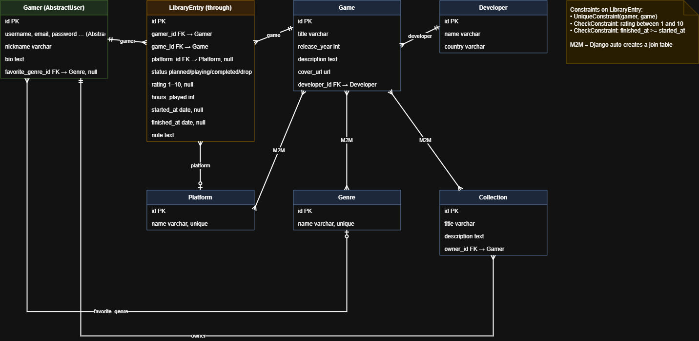

# Backlog Vault

> Steam for people with an empty wallet and a full backlog.

[Live Demo](https://backlog-vault.onrender.com/)

Backlog Vault is a Django web app where gamers keep track of their game
backlog: what they plan to play, what they are playing right now, what they
finished and what they dropped, with ratings, hours played and notes. Gamers
also build shared collections of games and discuss games and collections in
comments, while a small moderation team keeps the catalog tidy.

Anyone can browse the game catalog; everything else is for registered gamers.

## Features

- **Public game catalog**: search, genre / platform filters, pagination,
  cover images (upload or URL). Guests can open any game page.
- **Personal library**: a through-model with status, rating (1-10), hours,
  dates and notes, protected by database constraints.
- **Collections**: curated lists of games, with add / remove straight from a
  game page.
- **Comments** on games and collections for signed-in gamers, with author
  badges, delete confirmation and a character counter. Authors can delete
  their own comments, moderators can delete any.
- **Profiles** with statistics: games by status, hours, average rating, most
  played genre and a progress bar.
- **Roles**: guests, regular players, moderators and admins (see below).
- **Registration with account activation** (the link is printed to the
  console).
- **Dark / light theme** switch and a custom admin panel
  ([django-unfold](https://unfoldadmin.com/)).
- **Rich demo data**: 64 games, 39 developers, 16 genres, 8 platforms.

## Tech stack

Python 3.14, Django 6.1, Bootstrap 5 + Bootstrap Icons,
django-crispy-forms (Bootstrap 5 pack), Pillow, SQLite in development and
PostgreSQL in production, WhiteNoise, python-dotenv, flake8, GitHub Actions.

## Quick start

```bash
python -m venv .venv
.venv\Scripts\activate          # Windows
# source .venv/bin/activate     # macOS / Linux

pip install -r requirements.txt
python manage.py migrate
python manage.py seed_data      # demo data + demo users
python manage.py runserver
```

Open http://127.0.0.1:8000/. Development uses SQLite and needs no `.env`.
The header has a **Demo** menu
that signs you in as the admin, a moderator or a regular user in one click.

If you update an existing database, run `python manage.py migrate` and then
`python manage.py setup_roles` so moderators get the latest permissions.

## Demo accounts

All demo accounts use the password `testpass123`.

| Username                 | Role           | What they can do                          |
|--------------------------|----------------|-------------------------------------------|
| `demo_admin`             | Admin          | Everything, including the admin panel     |
| `demo_moderator`         | Moderator      | Manage games, reference data and comments |
| `demo_user`              | Regular player | Library, ratings, collections, comments   |
| `alex`, `maria`, `taras` | Players        | Extra sample users with libraries         |

## Roles and permissions

| Action                                            | Guest | Player |    Moderator     |  Admin  |
|---------------------------------------------------|:-----:|:------:|:----------------:|:-------:|
| Browse the catalog and game pages (with comments) |   +   |   +    |        +         |    +    |
| Browse collections, gamers, library               |   -   |   +    |        +         |    +    |
| Manage own library, collections, profile          |   -   |   +    |        +         |    +    |
| Comment on games and collections                  |   -   |   +    |        +         |    +    |
| Delete own comments                               |   -   |   +    |        +         |    +    |
| Delete any comment                                |   -   |   -    |        +         |    +    |
| Create / edit / delete games and reference data   |   -   |   -    |        +         |    +    |
| Open the admin panel                              |   -   |   -    | + (catalog only) | + (all) |
| Activate accounts, make moderators                |   -   |   -    |        -         |    +    |

**Guests** see a welcome page that explains what is available, the game
catalog and every game page with its comments. Buttons for the library,
collections and commenting are replaced with a hint to log in or register.
Any other page redirects a guest to the login form.

Moderators are regular gamers who are *staff* and belong to the `Moderators`
group (created by `python manage.py setup_roles`, also run by `seed_data`).
In the admin, select gamers and use **Make selected gamers moderators**.

## Registration and activation

New accounts are created **inactive**. The app generates an activation link
and prints the e-mail to the server console (no real e-mail is sent). Open
that link to activate the account and sign in, or ask a moderator or admin to
run **Activate selected gamers** in the admin panel. Switching to real e-mail
only needs the usual `EMAIL_*` / `MAILERS` settings.

## Demo data

`python manage.py seed_data` is idempotent, so it is safe to run it again.

| What                     | Count |
|--------------------------|------:|
| Games                    |    64 |
| Developers               |    39 |
| Genres                   |    16 |
| Platforms                |     8 |
| Gamers (with demo roles) |     6 |
| Library entries          |    79 |
| Collections              |    14 |
| Comments                 |    21 |

The data lives in `vault/management/commands/`: `_catalog.py` (genres,
platforms, developers, games) and `_activity.py` (extra library entries,
collections and comments), the rest is in `seed_data.py`.

## Configuration

Settings are split into a package, `backlog_vault/settings/`:

| Module    | Used for    | Database   | Debug | Demo login menu               |
|-----------|-------------|------------|-------|-------------------------------|
| `base.py` | shared      | -          | -     | -                             |
| `dev.py`  | development | SQLite     | on    | on                            |
| `prod.py` | production  | PostgreSQL | off   | off (`DJANGO_DEMO_MODE=1` on) |

`manage.py` uses `dev` by default, so no configuration is needed locally.
`wsgi.py` and `asgi.py` use `prod`. To pick another module, set
`DJANGO_SETTINGS_MODULE`.

Variables are read from the environment or from a `.env` file in the project
root (ignored by git); copy `.env.example` to get started.

| Variable                                                                                                    | Used in | Default               | Purpose                                                                                   |
|-------------------------------------------------------------------------------------------------------------|---------|-----------------------|-------------------------------------------------------------------------------------------|
| `DJANGO_SETTINGS_MODULE`                                                                                    | all     | `...settings.dev`     | Which settings module to load                                                             |
| `DJANGO_SECRET_KEY`                                                                                         | prod    | **required**          | Secret key                                                                                |
| `DJANGO_ALLOWED_HOSTS`                                                                                      | prod    | `127.0.0.1,localhost` | Comma separated host names                                                                |
| `DJANGO_CSRF_TRUSTED_ORIGINS`                                                                               | prod    | empty                 | Site origins with scheme, e.g. `https://my.app`                                           |
| `DJANGO_DEMO_MODE`                                                                                          | prod    | `0`                   | `1` shows the demo login menu                                                             |
| `DJANGO_SECURE_COOKIES`                                                                                     | prod    | `1`                   | `0` only to try prod settings locally over http                                           |
| `POSTGRES_DB`, `POSTGRES_USER`, `POSTGRES_PASSWORD`, `POSTGRES_HOST`, `POSTGRES_DB_PORT`                    | prod    | **required**          | PostgreSQL connection                                                                     |
| `EMAIL_HOST`, `EMAIL_PORT`, `EMAIL_HOST_USER`, `EMAIL_HOST_PASSWORD`, `EMAIL_USE_TLS`, `DEFAULT_FROM_EMAIL` | prod    | empty                 | SMTP for activation e-mails. Without `EMAIL_HOST` the links are printed to the server log |

To switch between environments change `DJANGO_SETTINGS_MODULE` in `.env`
(`...settings.dev` or `...settings.prod`). On a hosting platform set the
variables in its dashboard instead of uploading `.env`.

Never enable the demo login menu on a server with real accounts.
Uploaded covers are stored in `media/` (ignored by git).

## Deployment

Production runs with `backlog_vault.settings.prod`: PostgreSQL, `DEBUG` off,
secure cookies and static files served by WhiteNoise.

```bash
pip install -r requirements.txt
python manage.py collectstatic --noinput    # build command
python manage.py migrate                    # before each release
python manage.py seed_data                  # optional, demo data (first deploy)
gunicorn backlog_vault.wsgi                 # example start command, depends on the host
```

Required variables: `DJANGO_SETTINGS_MODULE`, `DJANGO_SECRET_KEY`,
`DJANGO_ALLOWED_HOSTS`, `DJANGO_CSRF_TRUSTED_ORIGINS` and the `POSTGRES_*`
set. Without SMTP settings, new accounts have to be activated by an admin in
the admin panel (**Activate selected gamers**) or from the link printed in the
server log. Uploaded covers are stored on the local disk, which many hosts
reset on every deploy; use cover URLs on such hosts.

## Database



The editable source is `docs/backlog_vault_db.drawio`.

Main models: `Gamer` (custom user), `Genre`, `Platform`, `Developer`, `Game`,
`LibraryEntry` (gamer, game and personal progress), `Collection` and
`Comment`. A comment belongs to **exactly one** game or collection, which is
enforced by a database `CHECK` constraint.

## Project structure

```
backlog_vault/        urls, wsgi/asgi and settings/ (base, dev, prod)
vault/
  models.py           Gamer, Genre, Platform, Developer, Game,
                      LibraryEntry, Collection, Comment
  views/              views split by section (home, games, library,
                      collections, comments, gamers, reference, ...)
  forms.py, mixins.py, roles.py, emails.py, backends.py, signals.py
  management/commands seed_data, setup_roles (+ seed data modules)
  tests/              test suite
templates/            base, includes and one folder per section
docs/                 database diagram
```

## Tests and code style

```bash
python manage.py test
flake8
```

The suite has more than 120 tests: models and constraints, permissions for
every role, guest access, comments, registration and activation, seed data
and a smoke test that opens every page.
GitHub Actions runs both commands on every pull request.
